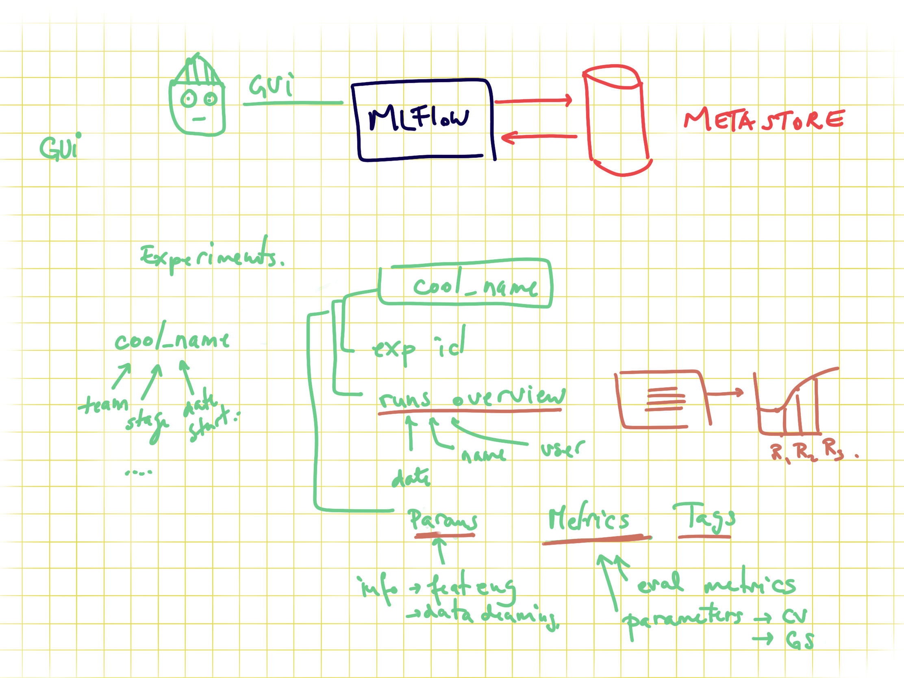
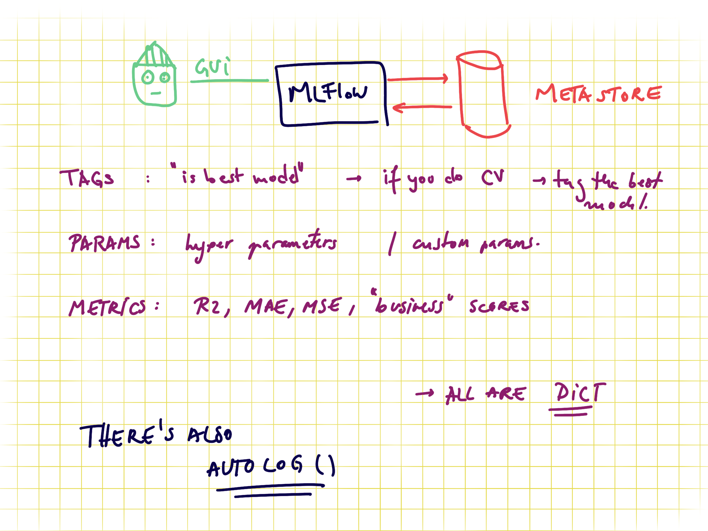

inspiration# Machine Learning for a Mechanical ventilator
## Overview
this project is a [Kaggle challenge](https://www.kaggle.com/competitions/ventilator-pressure-prediction) and it aims to develop a ML model to predict the lung pressure in a Mechanical ventilator.  <br>

In times of the global pandemic caused by COVID19, medical services experience an exceeding workload caused by the large number of patients in the hospitals. A significant part of these patients needs mechanical ventilation systems (MVS) occupying additional trained medical personnel. These specially trained people need to adjust the lung pressure on the MVS manually to ensure optimal oxygen supply. At the same time they need to prevent severe lung damage due to high pressure. <br> 
Also developing new methods for controlling mechanical ventilators is prohibitively expensive, even before reaching clinical trials. High-quality simulators could reduce this barrier. Current simulators are trained as an ensemble, where each model simulates a single lung setting. However, lungs and their attributes form a continuous space, so a parametric approach must be explored that would consider the differences in patient lungs.  <br>

A fully automatic MVS would reduce the workload of the medical staff and enable better care for other patients. For the adaptive and automatic mode of operation of such a device, machine learning (ML) methods are required. Our project aims to predict the lung pressure based on different lung attributes using various ML approaches. In that way, important parameters of the MVS can be assessed that help to build a superior software that assist to find an pressure output for the individual patient. By combining flexible models with time series elements, we are able to make predictions with high precision.

## Stakeholder info
Our stakeholder is People's Ventilator project(PVP), a project funded by Princeton University, as a team at Google Brain aims to grow the community around machine learning for mechanical ventilation control. They believe that neural networks and deep learning can better generalize across lungs with varying characteristics than the current industry standard of PID controllers. They cameup with a mechanical ventilator which can be build in 3 das by a single person in 3 days and it only costs around 1300$. If we compare it with the current existing ventilators (cost more than 10000 $), these are far more affordable. At the end their aim is to make it available for different health sectors!

## Data Structure
We were given different breaths corrsponding to different lung settings and the task was to predict the airway pressure in the respiratory circuit during the breath, given the time series of control inputs. Basic data structure looks like: <br> 
time_step : 80 timesteps corresponding to a breath <br> 
u_in : Inputflow which correspond to the amount of air that is flowing into the lungs <br> 
u_out : Indicator variable which tells whether the expiratory valve is open or not. If open, denoted by 0 and if closed (inspiration), denoted by  0 (exspiration) <br> 
R (Resistance) : Thickness of the inspiratory valve and how it correspond to the input flow <br>
C (Compliance) : Flexibility of the lungs and how it corresponds to the input flow <br>
Pressure : Target variable. Lung pressure during inspiration.

Apart from this basic features, we calculated additional feature doing feature engineering for eg: different air volumns and Time shifted features.

## Evaluation metrics
It is very important for us to predict the target variable, ie pressure very accurately. Because, if it is too low, the patient won't get enough oxygen and if it is too high, it can cause lung damage. Hence we need to have a measure of error corresponding to the pressure. In this case, we choose 
Mean Square Error (MAE) as our metric since it can give us the mean deviation of our prediction from the actual values of the target variable verywell, in our case pressure. MAE is too sensitive to lower and higher values of pressure

## Baseline model
We choose our baseline model to be a linear regression with polynomial function (degree 2) on our basic features (Input flow, output flow, R and C). 
Results are shown in the notebook: [baseline_model.ipynb](https://github.com/Lue-C/CapStone/blob/main/models/baseline_model.ipynb). This model gave us an MAE of 3.38 cmH2o and t clearly showed that our model is not enough to cope with very different pressure profiles. So we needed more complex models

## Machine Learning models
We started with simple ML models and XGBoost and Artificial Neural Network(ANN) gave us promising result in the initial stages. But then we realised that this problem can be 
treated as a Auto regression (AR) problem since the pressure values at a given time highly depends on the pressure values at the previous time steps. Hence we calculated AR features out of given features (Pressure and Input flow) by time shifting them. We used these features along with feature engineed ones in XGBoost and ANN. As we imagines, the results were promising and ANN gave us the best results sofar with an MAE of 0.15 ([ANN.ipynb](https://github.com/Lue-C/CapStone/blob/main/models/ANN.ipynb))

# ds-modeling-pipeline

Here you find a Skeleton project for building a simple model in a python script or notebook and log the results on MLFlow.

There are two ways to do it: 
* In Jupyter Notebooks:
    We train a simple model in the [jupyter notebook](notebooks/EDA-and-modeling.ipynb), where we select only some features and do minimal cleaning. The hyperparameters of feature engineering and modeling will be logged with MLflow

* With Python scripts:
    The [main script](modeling/train.py) will go through exactly the same process as the jupyter notebook and also log the hyperparameters with MLflow

Data used is the [coffee quality dataset](https://github.com/jldbc/coffee-quality-database).

## Requirements:

- pyenv with Python: 3.9.4

### Setup

Use the requirements file in this repo to create a new environment.

```BASH
make setup

#or

pyenv local 3.9.4
python -m venv .venv
source .venv/bin/activate
pip install --upgrade pip
pip install -r requirements_dev.txt
```

The `requirements.txt` file contains the libraries needed for deployment.. of model or dashboard .. thus no jupyter or other libs used during development.

The MLFLOW URI should **not be stored on git**, you have two options, to save it locally in the `.mlflow_uri` file:

```BASH
echo http://127.0.0.1:5000/ > .mlflow_uri
```

This will create a local file where the uri is stored which will not be added on github (`.mlflow_uri` is in the `.gitignore` file). Alternatively you can export it as an environment variable with

```bash
export MLFLOW_URI=http://127.0.0.1:5000/
```

This links to your local mlflow, if you want to use a different one, then change the set uri.

The code in the [config.py](modeling/config.py) will try to read it locally and if the file doesn't exist will look in the env var.. IF that is not set the URI will be empty in your code.

## Usage

### Creating an MLFlow experiment

You can do it via the GUI or via [command line](https://www.mlflow.org/docs/latest/tracking.html#managing-experiments-and-runs-with-the-tracking-service-api) if you use the local mlflow:

```bash
mlflow experiments create --experiment-name 0-template-ds-modeling
```

Check your local mlflow

```bash
mlflow ui
```

and open the link [http://127.0.0.1:5000](http://127.0.0.1:5000)

This will throw an error if the experiment already exists. **Save the experiment name in the [config file](modeling/config.py).**

In order to train the model and store test data in the data folder and the model in models run:

```bash
#activate env
source .venv/bin/activate

python -m modeling.train
```

In order to test that predict works on a test set you created run:

```bash
python modeling/predict.py models/linear data/X_test.csv data/y_test.csv
```

## About MLFLOW -- delete this when using the template

MLFlow is a tool for tracking ML experiments. You can run it locally or remotely. It stores all the information about experiments in a database.
And you can see the overview via the GUI or access it via APIs. Sending data to mlflow is done via APIs. And with mlflow you can also store models on S3 where you version them and tag them as production for serving them in production.


### MLFlow GUI

You can group model trainings in experiments. The granularity of what an experiment is up to your usecase. Recommended is to have an experiment per data product, as for all the runs in an experiment you can compare the results.


### Code to send data to MLFlow

In order to send data about your model you need to set the connection information, via the tracking uri and also the experiment name (otherwise the default one is used). One run represents a model, and all the rest is metadata. For example if you want to save train MSE, test MSE and validation MSE you need to name them as 3 different metrics.
If you are doing CV you can set the tracking as nested.


### MLFlow metadata

There is no constraint between runs to have the same metadata tracked. I.e. for one run you can track different tags, different metrics, and different parameters (in cv some parameters might not exist for some runs so this .. makes sense to be flexible).

- tags can be anything you want.. like if you do CV you might want to tag the best model as "best"
- params are perfect for hypermeters and also for information about the data pipeline you use, if you scaling vs normalization and so on
- metrics.. should be numeric values as these can get plotted


